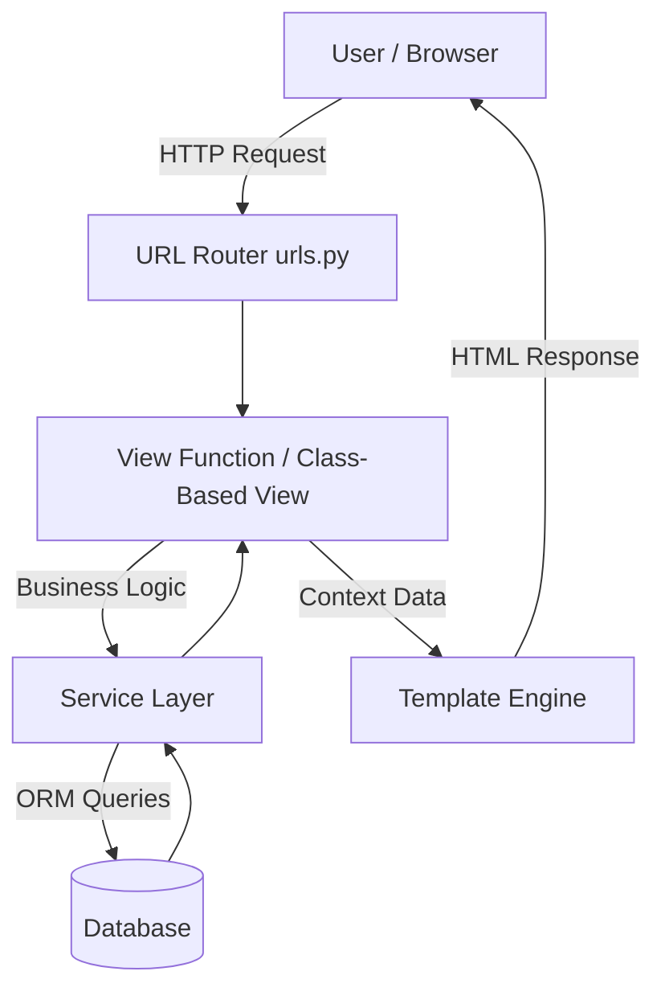

# Request Flow Diagram

This document explains how an HTTP request flows through the Coffee Shop Django application, from the user’s browser to the database and back.  
The goal is to clearly show responsibilities of each layer and keep the architecture scalable, testable, and easy to reason about.

---

## High-Level Request Flow (Django Web App)

