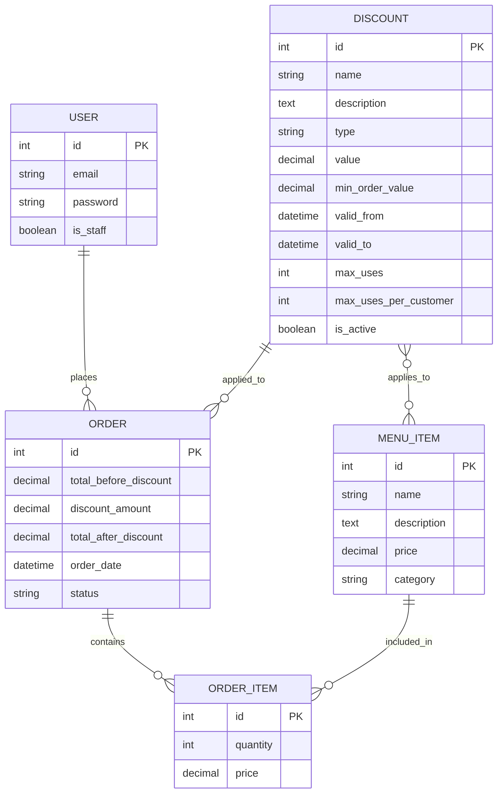

# Domain model

This document describes the core data model for the Coffee Shop App.  
The ERD captures entities, attributes, and relationships required to support menu browsing, order placement, and a flexible discount/coupon system.

The design directly follows the project requirements and is optimized for Django ORM implementation.

---

## Core Entities Overview

- User (Django built-in)
- MenuItem
- Discount
- Order
- OrderItem

---

## ERD Diagram

